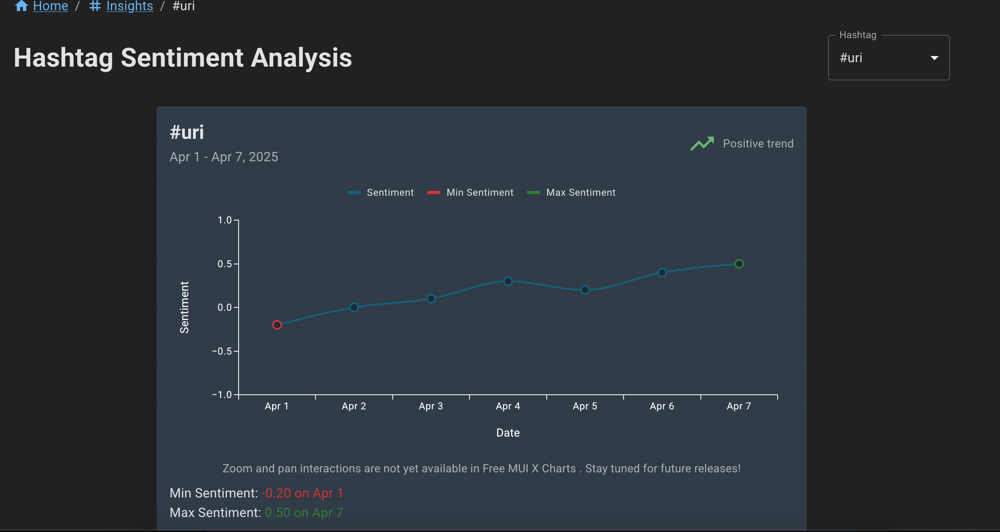
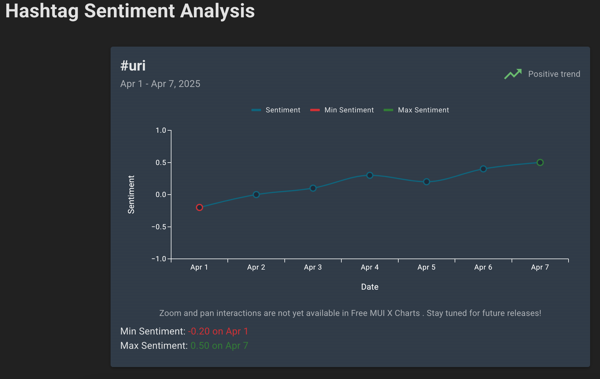
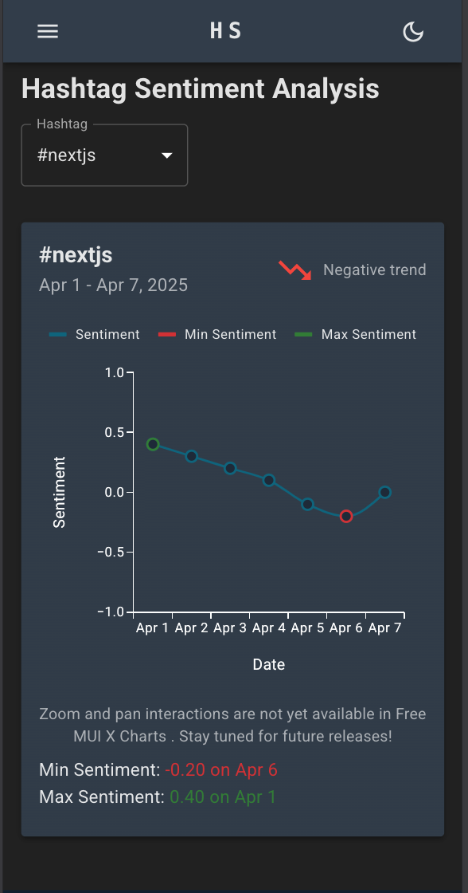

# Hashtag Sentiment Analysis Dashboard

---

## Overview

This project is a **Hashtag Sentiment Analysis Dashboard** built with **Next.js**, **React**, **Material-UI (MUI)**, and **React Query**. It visualizes sentiment trends of popular hashtags over a specific date range, allowing users to select hashtags dynamically from available tags fetched via an API.

### Key Features:
- Dynamic fetching of hashtag trend data and available hashtags using **React Query** and **Axios**.
- Responsive UI built with **Material-UI**.
- Interactive hashtag selection with dropdown.
- Trend visualization (via a dynamically imported chart component).
- Error handling and loading states for smooth UX.
- Server-side rendering disabled on heavy chart component to optimize performance.
- Breadcrumb navigation for better user experience.

---

## Approach

- Used **React Query** to manage asynchronous API calls, caching, and background refetching.
- Implemented **custom hooks** (`useHashtagTrend`) to abstract data fetching logic.
- Fetched all available hashtags on page load and memoized the list for rendering in a dropdown.
- Used **Next.js dynamic imports** with client-side rendering only for charts to improve page load.
- Created a clean, mobile-responsive UI with **MUI** components.
- Used React's **`useMemo`**, **`useCallback`**, and **`useEffect`** hooks for performance optimization.
- Gracefully handled loading, error, and empty states.
- Included navigation breadcrumbs for user context.

---

## Screenshots / Demo

### Hashtag Selection and Trend Visualization



### Trend Chart Display



### Responsive Mobile View



---

## Time Spent

- **Initial setup and environment:** 20 minutes
- **API integration and data fetching:** 20 minutes
- **UI development with Material-UI:** 20 minutes
- **Chart integration and dynamic imports:** 30 minutes
- **Error handling and optimization:** 20 minutes 
- **Testing and refinements:** 20 minutes

**Total time spent:** ~2 hours

---


## How to Run

```bash
git clone https://github.com/gbengacode/hashtag-sentiment-dashboard.git
cd hashtag-sentiment-dashboard
npm install
npm run dev
```
## Live Demo
[Visit Hashtag Sentiment Dashboard](https://hashtag-sentiment-dashboard.vercel.app)